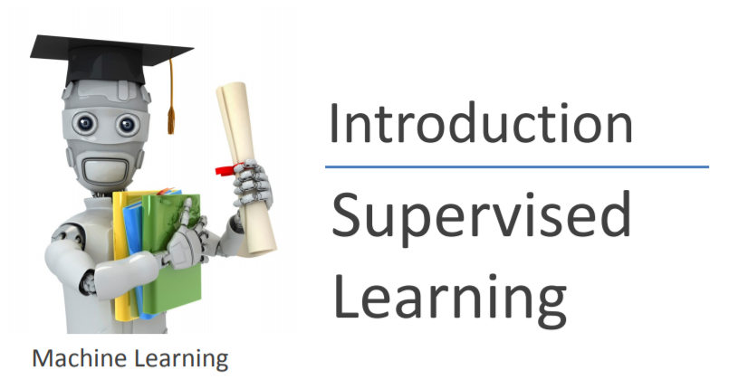

> 作为英语课程，读中文参考资料的确有助于理解，但是出于对以后更长久的学习优势考虑，笔记中我会尽量采用英文来表述，这样有助于熟悉专有名词以及常见语法结构，对于无中文翻译的资料阅读大有裨益。

#  Week1
##  一、Introduction
## 二、Algorithm（算法）:

  1. Supervised Learning（监督算法）
  - 每个样本有一个正确答案
    - 肿瘤分类
  2. Unsupervised Learning
     - 并不知道样本正确与否，仅仅做一个分类
       - 天文学星系聚集
  3. Others: Reinforcement learning（强化学习）.etc

## 三、Linear Regression with One Variable

1. 单变量线性回归
   - Regression（回归）：根据历史数据推测未来数据

2. Training Set训练集m
   - 训练集m
   - 输入变量x
   - 目标变量y
   - 训练集实例(x,y)
   - 参数parameter$\theta$
   - 学习率$\alpha$，Learning Rate
   - h——hypothesis学习算法得到的解决函数（模型）
   - （x ^(i)^ ,y ^(i)^ ）具体的事例

3. Cost Function代价函数，又称为误差平方d代价函数
   - 线性回归函数：h$_\theta$ (x)= $\theta_0$+$\theta_1$x
   - Cost Function: J($\theta_0$,$\theta_1$)=$\frac{1}{2m}\sum_{i=1}^{m}(h_\theta(x^i)-y^i)^2$ 
     - 代价函数应当最小，代价函数绘制了等高线图

4.  Gradient Descent梯度下降
   - 一种方法，找到J($\theta$)的最小值

5. Gradient Descent Algorithm梯度下降算法
   - $\theta_j:=\theta_j-\alpha\frac{\partial}{\partial\theta_j}J(\theta_0,\theta_j)$
   - 对于不同的迭代$\theta_j$务必需要同步更新

6. Linear Regression and Gradient Descent Algorithm
   - $\frac{\partial}{\partial\theta_j}j(\theta_0,\theta_1)=\frac{\partial}{\partial\theta_j}\frac{1}{2m}\sum_{i=1}^m(h_\theta(x^i)-y^i)^2$
   - 代入5.2中的公式可以得到$\theta$的迭代公式如下
   - $\theta_0:=\theta_0-\alpha\frac{1}{m}\sum_{i=1}{m}((h_\theta(x^i)-y^i))$
   - $\theta_1:=\theta_1-\alpha\frac{1}{m}\sum_{i=1}{m}((h_\theta(x^i)-y^i)x^i)$
   - Called:批量梯度下降

   ## 四、线性代数回顾

   1. 如题，对矩阵的转置、取逆运算等进行了回顾

