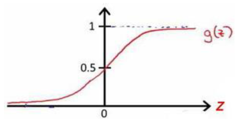
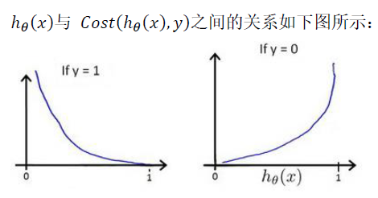

> 作为英语课程，读中文参考资料的确有助于理解，但是出于对以后更长久的学习优势考虑，笔记中我会尽量采用英文来表述，这样有助于熟悉专有名词以及常见语法结构，对于无中文翻译的资料阅读大有裨益。

#  Week3 Logistic Regression and Regularzation 
## 一、Logistic Regression

1. Classification分类问题

2. Logistic Regression逻辑回归模型

   - $h_\theta(x)=g(\theta_TX)$
     - 对于给定的输入变量X,$\theta$,计算输出变量=1的可能性
     - $h_\theta(x)=P(y=1|x;\theta)$
     - $h_\theta(x)>=0.5,y=1$
     - $h_\theta(x)<0.5 ,y=0$
   - X:Feature Vector
   - g:Logistic function/Sigmoid function
     - $g(z)=\frac{1}{1+e^{-z}}$
     - 

3. Decision Boundary决策边界

   1. 根据逻辑回归模型函数可归纳得到

      $\theta^Tx>=0,y=1$

      $\theta^T<0,y=0$

4. 如何拟合Logistic Regression的参数$\theta$——Cost Function

   1. We know in Linear Regression
      - $j(\theta)=\frac{1}{m}\sum_{i=1}^{m}\frac{1}{2}(h_\theta(x^i)-y^i)^2$
   2. In Logistic Regression
      - $J（\theta)=\frac{1}{m}\sum_{i+1}^{m}Cost(h_\theta(x^i)-y^i)$
        - $Cost(h_\theta,y)=-log(h_\theta(x)) ,y=1$
        - $Cost(h_\theta(x),y)=-log(1-h_\theta(x)) ,y=0$
        - $Cost(h_\theta,y)=-ylog(h)-(1-y)log(1-h)$
        - 带入J（$\theta$)后得到的J可以证明是一个凸函数，化简后代价函数形式上与Linear Logistic的代价函数一致
        - $J(\theta)=\frac{1}{m}\sum_{i=1}^{m}[h_\theta-y]x_j$
      - 
      - Meaning: when y=0 h=0,then Cost=0;when y=0,h=1,then cost->$+\infty$
      - ​